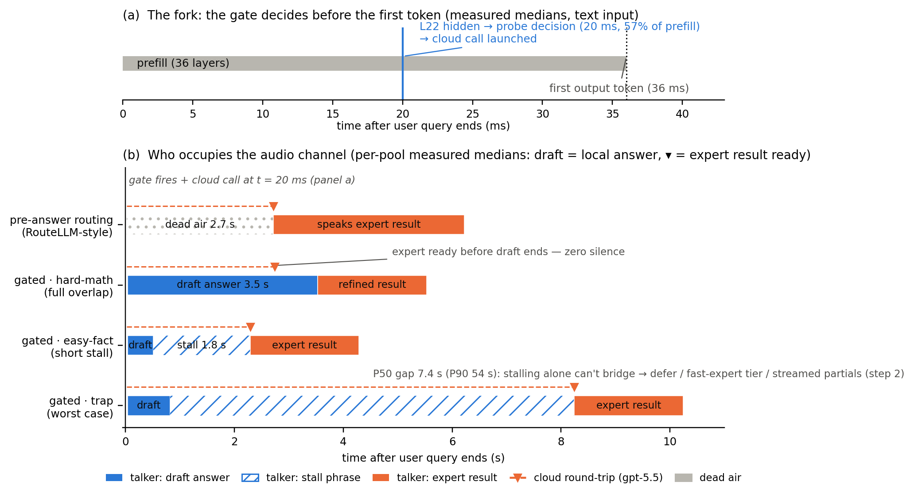

# When Does a Small Model Know to Hand Off?
## Zero-Training Escalation Gates for Full-Duplex Speech Models

**Technical Report — v5** (v1: 2026-07-13, probe gate; v2: 2026-07-14, audit +
p(True) + 3-backbone replication; v3: 2026-07-24, adds Phases 5c–6d + system
profiling — the duplex-damage mechanism story, audio-input replication, the
thinking ablation, and the fork/overlap latency analysis; v4: 2026-07-30,
adds §8b — Part 2 executed: live duplex gate, conflict injection, live
tradeoff curve with bootstrap + dual-view decomposition, router baseline,
FalseQA blind spot; v5: 2026-08-05, router training receipt + RouterBench
grounding + probe receipt in §8b.5)
Date: 2026-08-05 · Seed: 42 · Status: Parts 1 and 2 complete (Phases 0–8j)

---

## Abstract

This is **step 1 of a larger plan**: teach a small full-duplex conversational
model to know *when to hand a query off* to a large cloud model (step 2 — how
the big model's result comes back into the live session — is future work). We
attach zero-training escalation gates to MiniCPM-o 4.5 (9B omni/duplex, Qwen3
backbone) and evaluate them against small-model failure labels on 600 frozen
public-benchmark queries (SimpleQA, MMLU-Pro, TriviaQA, GSM8K/MATH-500,
dolly/alpaca), with matched-pair controls across 10 backbones/fine-tunes and
both text and speech input. Main findings:

1. **A last-layer hidden-state probe looks good (AUC 0.822) but is mostly a
   query-type shortcut** — pool-identity oracle 0.715; leave-one-pool-out it
   inverts on math (0.372). Verbalized self-eval ("p(True)": read P(Yes) off
   one token of "Would you answer this correctly?") beats it with zero
   training on most backbones, and catches 100%-fail long-tail traps the
   probe misses — *if asked before the model answers*.
2. **Duplex fine-tuning damages self-knowledge readouts, not self-knowledge.**
   Matched pairs (Qwen3-8B → MiniCPM-o 4.5; Qwen2.5-7B → Qwen2.5-Omni /
   MiniCPM-o 2.6) show LOPO probe transfer degrade raw > omni-streaming >
   duplex, label-coverage controlled. A full layer × position sweep localizes
   the damage: mid-layer transfer is near-raw (LOPO math **0.931** at L22 vs
   **0.366** at L35) — the duplex fine-tune **overwrites the late-layer
   last-token readout** (where a streaming head encodes turn control), it
   does not destroy the information.
3. **Each readout breaks in one modality and survives in the other.** The
   late-layer cliff is *text-input-specific* (audio input: L35 = 0.936, no
   cliff; unchanged under the speak-mode template — it tracks input
   modality, not output mode). Conversely, pre-answer verbalized
   introspection *collapses on audio input* (trap p_yes 0.055 → 0.556) on
   both MiniCPM duplex generations while the omni-streaming and
   frozen-backbone controls stay intact — duplex-specific again. Controlled
   arms (filler-audio, audio+text-dup) and an ASR audit pin the mechanism:
   the verbal self-check runs over *text-token pathways*; audio embeddings
   don't feed it, though a probe reads the same information at 0.93+.
4. **The modality-shared mid-layer core is created by end-to-end training.**
   Text↔audio probe transfer is ~0.86 on every end-to-end model, ≈ dead
   (0.52–0.60) on Freeze-Omni's frozen backbone with identical text weights.
   Four quadrants: e2e training builds the shared core; duplex training
   damages the readouts; omni-streaming gets both right; a frozen adapter
   gets neither.
5. **The gate wins as a system.** Mid-layer probe = best pre-decode signal
   (test area +0.064 vs final-layer +0.054); it decides in **20 ms (text) /
   45 ms (audio) — before the first output token**. Against MiniCPM-o 4.5's
   own `enable_thinking`, gated-cloud escalation dominates on BOTH axes at
   every rate (e.g. @33%: acc .787 vs .637 at 3.4× lower latency). Cloud
   round-trip overlaps the talker's floor time: the expert result is ready
   before the local answer ends for 40–58% of the test mix, though only
   20–31% of *gate-escalated* queries (they skew short-answer) — stall
   phrases of P50 ~2–3 s bridge the rest.

**Step-1 answer:** zero-training self-knowledge exists, is strong, and is
*modality- and layer-fragile in systematic, duplex-induced ways*. A deployable
gate reads a mid-layer (~60% depth) at prefill — the one signal that survives
every condition tested — with verbalized p(True) as the zero-plumbing
alternative on text input and post-draft check where a draft is affordable.

---

## 1. Setup

| Component | Value |
|---|---|
| Target model | MiniCPM-o 4.5 (9B, Qwen3-8B backbone, omni + full-duplex FT), bf16, SDPA |
| Matched-pair controls | Qwen3-8B (raw); Qwen2.5-7B (raw) vs Qwen2.5-Omni-7B (streaming omni) vs MiniCPM-o 2.6 (duplex); Qwen2-7B (raw) vs Qwen2-Audio-7B (audio FT) vs Freeze-Omni (frozen backbone + adapter); Mistral-7B-v0.3, GLM4-9B-chat (raw diversity) |
| Infra | Modal, H100; torch 2.8.0, transformers 4.51.0 pinned (4.57.6 for omni; 4.45.2 for Freeze-Omni) |
| Judge | `gpt-5.4-mini` (blind, structured outputs); validated by gpt-5.5 re-judge: agreement .962 text / .945 audio, headline deltas ≤ .010 |
| Escalation target | `gpt-5.5` |
| Audio arm | frozen pool TTS-rendered (OpenAI tts-1, voice alloy; content unchanged — public benchmarks only, only modality synthetic, per Spoken-SQuAD/VoiceBench practice) |
| Determinism | greedy, seed 42; 600 queries frozen, 360 calib / 240 test |

**Query pool (600, public benchmarks only):** trap = SimpleQA 50 (MiniCPM
fails 100%); hard-knowledge = MMLU-Pro 150; easy-fact = TriviaQA 100;
easy-chat = dolly-15k + alpaca-zh 150; hard-math = GSM8K tail + MATH-500 150.
Text fail rates: trap 1.00 / knowledge .48 / fact .34 / chat .21 / math .19
(overall .358). Audio adds a modality tax of +5 to +15 pts per pool.

**Candidate gate signals (all zero-training):** decode-scalar (entropy /
margin), linear probe on hidden states (position × layer swept), verbalized
self-eval p(True) = P(Yes) off the first token of a pre-answer ("Would you
answer this correctly?") or post-draft ("Is this answer correct?") prompt.

---

## 2. RQ1 on text input: which signal knows the model will fail?

### 2.1 Headline AUCs (MiniCPM-o 4.5, calib, probe = 5-fold OOF)

| signal | AUC | training needed |
|---|---:|---|
| **ptrue_post** | **0.899** | none |
| probe on h_prompt (final layer) | 0.822 [0.777, 0.863] | LR on calib |
| **ptrue_pre** | 0.807 | none |
| max_entropy@4 (best scalar) | 0.696 | none |

### 2.2 The probe's number is a type shortcut (audit)

h_prompt classifies the source pool at 95.8%; a pool-identity oracle alone
reaches AUC 0.715; appending true pool labels to the probe adds nothing
(0.822 → 0.821). LOPO: math **inverts** (0.372 — the probe scores terse
MATH-500 "safer" than verbose GSM8K: style familiarity), trap mean score
0.232 on 100%-fail questions. Entropy ≈ chance on 2 of 3 raw backbones.

### 2.3 p(True): ask before it answers

Pre-answer trap introspection is 3-for-3 on raw/duplex text: on 100%-fail
SimpleQA the model says "No, I won't get this right" (mean escalation score
0.945) — asked *after* answering it endorses its own confident-wrong answer
(0.945 → 0.360). ptrue_post beats the trained probe on 4 of 5 backbones
tested (exception GLM4: 0.685 < probe 0.798 — "p(True) always wins" is
softened to "usually; depends on self-eval calibration quality").

---

## 3. The duplex effect: overwritten readouts, intact knowledge

### 3.1 Matched pairs — damage tracks duplex-ness, not audio (5c)

LOPO transfer of the standard (final-layer, last-token) probe, one backbone
family (Qwen2.5-7B), label-coverage matched (`lopo_matched2`):

| LOPO | qwen2.5-7b raw | qwen2.5-omni (streaming) | minicpm-o26 (duplex) | [o4.5, Qwen3 base] |
|---|---:|---:|---:|---:|
| hard-math | **0.809** | 0.745 | **0.538 ≈ chance** | 0.372 inverts |
| hard-knowledge | 0.680 | 0.613 | **0.526 ≈ chance** | 0.61 |

Raw matched to o2.6's exact fail rates keeps math at 0.825 → label coverage
ruled out on a second backbone; the **representation** changed. Gradient:
raw > omni-streaming > duplex. (Qwen2-Audio pair: capability collapse
confound, documented negative; raw baselines vary — the defensible statistic
is the within-pair Δ.)

### 3.2 Layer × position sweep — the cliff (5d)

Prefill-only capture of every decoder layer × {last-token, mean-pool}.
Final-layer numbers reproduce the generation-time hooks 5-for-5.

| model | best mid-layer (LOPO math, last-tok) | final layer | shape |
|---|---:|---:|---|
| qwen3-8b raw | 0.964 (L33/36) | 0.958 | plateau, no cliff |
| **minicpm-o45 duplex** | **0.931 (L22/36)** | **0.366** | cliff L31→L34 (.757→.357), inverts |
| qwen2.5-7b raw | 0.893 (L21/28) | 0.809 | mild dip |
| qwen2.5-omni streaming | 0.794 (L16/28) | 0.746 | diffuse mild depression, no cliff |
| **minicpm-o26 duplex** | **0.822 (L21/28)** | **0.540** | cliff L21→L27 |

Mid-network, the duplex model carries near-raw transferable difficulty info
(within-pair Δ −0.03 at best layer vs −0.59 at the readout). Mean-pooling
survives to the final layer on duplex models → the damage is **(late-layer ×
last-token)-specific** — exactly where a streaming head must encode
turn-control state. Duplex damage is severe but LOCAL; omni-streaming damage
is mild but DIFFUSE. This *revises* the v2 conclusion: the self-knowledge
signal exists and is strong; the standard readout just can't see it on
duplex models.

### 3.3 Does the mid-layer probe convert into a better gate? (5e)

Frozen-test tradeoff areas (same protocol as Phase 5): probe_final +0.054 <
ptrue_pre +0.059 < **midlayer_L22 +0.064** < ptrue_post +0.068 (post-draft
only). L20–L30 all ≥ +0.056 (not knife-edge); mean-pool uniformly worse.
The in-mix area *under-sells* the mid-layer probe: its real advantage is
LOPO robustness (math .93 vs .37), which a same-mix test can't show. Caveat:
probe quantile-threshold transfer is weak (needs Phase-3-style
C-compression calibration if deployed); p(True) transfers rates much better.

---

## 4. Speech input: each readout has one blind modality

### 4.1 The cliff is text-input-specific (6a)

Same frozen pool, TTS-rendered, pure-audio content. Audio→audio LOPO math:
mid-layers L12–L16 hit .93–.96, and the final layer **does not invert:
L35 = .936** (text .366). Speak-mode template control (`use_tts_template=True`
on text input): cliff unchanged (L35 .362) → the operative variable is the
modality of the *context* (text tokens vs audio embeddings), not the output
mode. The duplex fine-tune re-purposed late-layer last-position processing
of text-token contexts specifically.

### 4.2 Cross-modal probe transfer works — on e2e-trained models (6a, 6d)

Probes trained on TEXT hiddens, scored on AUDIO hiddens (and vice versa):
early layers are modality-specific (.54–.60), from ~50% depth the
representation is modality-shared — text→audio **.855 at the deployed L22**
(plateau .82–.87). Replicates on o2.6 (onset ~46% depth, plateau .74–.80)
and cross-family on qwen2.5-omni (onset ~25%, plateau .80–.83). But on
**Freeze-Omni** — identical frozen Qwen2-7B weights, audio via adapter —
transfer is ≈ dead (text→audio .52–.60, audio→text .34–.54): **the shared
mid-layer core is CREATED by training the backbone on the modality**, an
adapter aligns well enough to converse but audio-context hiddens live off
the text manifold. Practical recipe validated: calibrate the gate on cheap
text data, deploy on speech — for end-to-end models only.

### 4.3 Verbalized introspection collapses on audio — duplex-specific (6a/6b)

| model | FT type | trap p_yes pre, text → audio | audio ptrue_pre AUC |
|---|---|---|---:|
| minicpm-o45 | duplex | .055 → **.556** (collapse) | .786, trap dead |
| minicpm-o26 | duplex | .196 → .345, all pools compress to ~.5 | **.491 ≈ chance** |
| qwen2.5-omni | omni-streaming | .279 → **.213 intact** | .727 |
| Freeze-Omni | frozen + adapter | .165 → **.112 intact** | (.612; capability-collapse caveat) |

Mechanism nailed by three controls on o4.5: (1) ASR audit — trap WER .074
(heard fine), p(True) on the model's OWN transcript snaps back to .074 ≈
text; well-heard subset still collapses; corr(WER, p_yes) ≈ 0 → not
perception. (2) Filler-audio arm — irrelevant audio does NOT inflate p_yes
(depresses it) → not a context prior/persona. (3) Audio+text-dup arm — text
tokens of the same question alongside the audio fully restore introspection
(.034) → **binding: the verbal instance-check runs over text-token
pathways; audio embeddings don't feed it**, while the probe reads the same
instance info at .93+. Log-odds decomposition agrees: the audio shift is
graded (chat +0.19 → trap +4.37), i.e. verbal self-assessment regresses to
type-level priors on audio. Cheap fix confirmed twice: any text
re-presentation (own transcript, dup) restores the signal
("repeat-then-judge").

A within-pool AUC decomposition agrees and sharpens the picture: on audio,
pool identity alone carries .709 of the .786 total, and the surviving
instance-level discrimination is selective — math .901 (above text's .809),
knowledge .732, trap .365 (sub-chance). Instance introspection that rests
on difficulty sensing survives the modality switch; instance introspection
that rests on entity recall does not.

Elegant symmetry: the probe's readout is text-fragile, p(True)'s readout is
audio-fragile — in both cases the knowledge survives and a *readout* breaks,
and in both cases the breakage is duplex-FT-specific.

### 4.4 Real-speech validation: the audio findings are not TTS artifacts (7b)

Every audio number above uses TTS speech (one voice). Arm B reruns the
matched-pair design on 200 REAL human recordings (VoiceBench sd-qa, USA
split; NQ-style factoid questions with references), each question run both
as typed text and as the human recording; gpt-5.4-mini judge, 0 errors.
All three audio-side findings replicate:

- **modality tax**: fail rate .400 text → .450 audio;
- **audio overconfidence**: paired p_yes_pre shift +.089 (audio > text on
  62% of queries); on the failure subset .415 → .581;
- **layer structure**: early layers dead (≤L11, .42–.55 all transfer arms),
  sharp rise after ~50% depth, audio late layers usable through L35
  (.74–.77), and the deployment recipe (text-calib probe → real-speech
  audio) holds a .76–.80 band at L22–L26 (peak .800 @ L25). Magnitudes sit
  below 6a's .86 as expected: sd-qa content is also out-of-pool, so this is
  transfer across BOTH content and modality — a strictly harder test.

p(True) on real speech: pre AUC .769/.771 (text/audio), post .813/.743.
Scope note: the text-side math cliff is untestable on sd-qa (no math);
it never involved synthetic audio, so it needed no arm-B protection.

---

## 5. Mechanism synthesis: four quadrants

| | shared mid-layer core | faithful readouts |
|---|---|---|
| raw text backbone | (text only) | ✅ |
| omni-streaming e2e (qwen2.5-omni) | ✅ built | ✅ intact |
| **duplex e2e (MiniCPM-o ×2)** | ✅ built | ❌ overwritten (probe: late-layer/text; verbal: audio) |
| frozen backbone + adapter (Freeze-Omni) | ❌ absent | ✅ verbal survives (capability craters instead) |

End-to-end multimodal training BUILDS the shared semantic core; duplex-style
training additionally DAMAGES the readouts; omni-streaming gets both right;
an adapter alone gets neither. For gate design this means: the mid-layer
last-token probe is the one signal that survives every quadrant that can
converse.

---

## 6. RQ2/RQ3 — the gate as a system

### 6.1 Accuracy tradeoff (frozen test n=240)

small-only **0.588**; big-only (gpt-5.5) **0.917**; paraphrase-relayed big
0.879 (relay tax 1–4 pts). Every gate beats random escalation at every
operating point; balanced tier @33% escalation → **0.779–0.787**, recovering
~58% of the small→big gap at 1/3 the cost ($1.12/100q big-only).

Honest baseline (added 2026-07-29): a **pool-oracle router** (escalate by
the pool's calib fail rate — type information only) captures **+0.042** of
the gate's **+0.054** area over random; the internal signal's
in-distribution residual is **+0.012** (~2 pts at the balanced budget) —
the system-level counterpart of §2's AUC decomposition (0.715 of 0.821).
The gate's case over type routing rests on LOPO transfer, not this margin.

### 6.2 Against the model's own thinking mode (6c)

MiniCPM-o 4.5 ships `enable_thinking`. Policy table (test n=240; latency =
per-pool measured medians, think per-query, cloud per-query):

| policy | acc | lat mean s | P50 | P95 |
|---|---:|---:|---:|---:|
| fast-only | .588 | 3.0 | 3.5 | 4.2 |
| all-THINK (o4.5's own) | .637 | 22.4 | 17.2 | 60.1 |
| gated-think @.33 | .613 | 12.1 | 3.6 | 47.6 |
| **gated-cloud @.15** | .688 | 5.3 | 3.6 | 10.1 |
| **gated-cloud @.33** | **.787** | **6.5** | 3.6 | 20.8 |
| gated-cloud @.50 | .858 | 7.0 | 3.6 | 24.4 |

**Gated-cloud dominates all-THINK on both axes at every escalation rate.**
Gated-think is weak for a mechanistic reason: the gate predominantly flags
knowledge/trap failures, which thinking cannot fix (thinking helps math
.187→.127, HURTS chat .207→.233) — external escalation is *necessary*, not
just better.

### 6.3 The fork: gate decision lands before the first token (6c/7a)

The probe is one 4096-d dot product on a hidden state already being
computed — the "fork" at layer k costs microseconds and the main forward
never waits (Jisen's parallel-branch design is free by construction; the
real question is at which depth the signal is sufficient). Measured on H100
(CUDA-synced, truncated-forward methodology):

| quantity | text | audio |
|---|---:|---:|
| L22 truncated decision (the gate) | **20 ms** | **45 ms** |
| TTFT (full prefill + 1st token) | 36 ms | 68 ms |
| ptrue_pre (extra short prefill) | 39 ms | 67 ms |
| full answer (= ptrue_post entry fee) | 1 855 ms | 3 507 ms |

The decision exists **before decoding starts** and sits far inside the
200–300 ms voice turn-taking budget. Per-layer truncated-forward curves
(`prefill_timing` / `fork_report`, figures/fork_pareto.png): L22's hidden
is available at **57% of prefill wall-time** (text; 61% audio) and L22 is
simultaneously the in-mix quality peak (OOF .866 > final layer .835) —
deciding early costs nothing, and escalation can launch while the last
~40% of prefill plus decode still runs. Forking at ~L10 is too early
(.794, and pre-50%-depth layers are modality-specific per §4.2); the fork
belongs at ~55–60% depth. On audio, the encoder front-end (~20 ms) is paid
before layer 0 regardless of fork depth.

### 6.4 Cloud round-trip overlaps the talker's floor time (7a)

If the gate fires at prefill and the cloud call launches immediately, is
the expert result ready before the talker finishes speaking (so the next
turn can deliver it)? Per-query gpt-5.5 latencies (P50 3.0 s / P95 24.4 s)
vs pool-matched measured local answer durations (`overlap_report`,
figures/overlap.png):

| P(result ready before local answer ends + slack) | +0 s | +2 s | +5 s |
|---|---:|---:|---:|
| whole test mix, text | .40 | .65 | .81 |
| whole test mix, audio | .58 | .75 | .84 |
| gate-escalated @.33, text | .20 | .39 | .60 |
| gate-escalated @.33, audio | .31 | .47 | .63 |

The catch: **escalated queries skew toward short local answers** (trap and
knowledge — trap overlap ≈ 0), so pure overlap covers only ~a fifth to a
third of escalations; the residual wait after the local answer ends is
**P50 2–3 s** (one stall sentence) but P90 ~27 s — the tail is gpt-5.5's
own reasoning latency, which argues for a fast-expert tier or streamed
partial results in step 2. Audio helps (longer utterances buy time).

**Figure — escalation timelines (all measured medians, text arm).**
(a) The fork: the L22 probe decision (20 ms, 57% of prefill) precedes the
first output token (36 ms); the cloud call launches while prefill is still
running, so the talker never waits on the gate. (b) Audio-channel occupancy
across four scenarios: pre-answer routing (RouteLLM-style) leaves 2.7 s of
dead air before anything is spoken; gated hard-math fully overlaps the
cloud round-trip (expert P50 2.7 s < draft 3.5 s — zero silence); gated
easy-fact bridges with one 1.8 s stall sentence; gated trap is the
structural worst case — gpt-5.5 is slowest exactly on the SimpleQA traps
(P50 8.2 s, P90 54 s) while the local draft is shortest (0.8 s), leaving a
7.4 s gap that stalling cannot bridge — the step-2 problem. Vector version:
`figures/timeline_scenarios.pdf`; script `figures/timeline_scenarios.py`.

---

## 7. Positioning vs LLM routing

RouteLLM-class routers (Ong et al., 2406.18665) decide *before* generation
from query-side features (embeddings, preference-trained matchers) — the
big model then answers the user directly, so no result-injection problem
exists. Two reasons that shape doesn't transfer to full-duplex voice, which
is why this project is step 1 of a two-step design: (1) the user talks to
ONE voice — the talker must speak whatever comes back, and the session
state (audio context, duplex KV) lives in the small model; (2) query-side
routing is exactly the "type recognition" our audit exposed — our probe's
oracle-gap analysis (pool oracle 0.715 vs probe 0.822) quantifies how much
a query-feature router can know in-distribution, and LOPO shows that
component fails across distribution shift while the model-internal
mid-layer signal transfers (math .93). LLMRouterBench (2601.07206) reports
most routers fail to beat simple baselines under a standardized protocol
and attributes the oracle gap to model-recall failures — consistent with
our "the signal must come from the answering model itself, not the query"
conclusion; its protocol is the natural home for a head-to-head
query-feature-router vs internal-signal-gate comparison under distribution
shift (future work).

---

## 8. Design consequences + step 2 preview

**Two-stage gate, final form:**

- **Stage 1 (prefill, free):** mid-layer (~60% depth) last-token probe —
  20/45 ms, before the first token, survives duplex FT and both input
  modalities; needs score-scale calibration for threshold transfer.
- **Stage 2 (optional, post-draft):** ptrue_post on the draft — the
  strongest overall signal; the draft doubles as the distilled escalation
  query and the fallback answer. On audio input, run p(True) on the model's
  own transcript ("repeat-then-judge"), never on raw audio context.

**Step 2 (result injection) is now scoped by data:** the streaming smoke
verified the official injection point (`teacher_forcing_text` per chunk) and
surfaced the first real problem — the model *pushes back* on injected expert
results that conflict with its own reasoning rather than relaying them. The
overlap analysis (6.4) adds the timing constraint: P50 one stall sentence,
P90 dominated by the expert's own latency. Injection protocol design +
authority framing was the next phase — executed in §8b below.

## 8b. Part 2 executed: the live gate + result injection (Phases 8–8g, 2026-07-25/30)

### 8b.1 The streaming loop: end-of-turn read decides, prefetch dies

Live per-chunk probe scores are weaker than the offline reference (best
chunk statistic AUC .764 vs offline .843) and structurally miss trap
(entity back-loaded into the zero-padded tail chunk; live fire 1/5). Fix:
the **end-of-turn read** — after the last audio chunk, prefill an
assistant turn containing a single space and read L22 at assistant-start
(the streaming analogue of h_prompt). **AUC .887 > offline .843**; trap
fire@balanced .20 → **.90**; costs 22 ms, still pre-first-token; it is the
*only* decision gate (thresholds = quantiles of this one score — the
chunk/turn joint-calibration problem disappears).

Mid-stream firing survives only as hypothetical speculative prefetch, and
a completeness curve killed it before it was built: acceptance ("would an
expert answer to the partial transcript answer the full question?") is
**.07/.19/.51 at 25/50/75%** of the words; at the chunk gate's typical
fire point (27–40% of audio) that is ~.2–.4 → 6–8 of 10 speculative calls
wasted. Trap's floor (.00/.10/.27) is the same back-loaded-core property
that broke the mid-stream probe — one property, measured twice (hidden
states + semantics). The expert starts at end of turn. Framing for the
paper: query-level speculative execution with too-low an acceptance rate.

Deployment-honesty decisions: expert query = the talker's **own
transcription** (P50 2.2 s, overlapped with the stall TTS), not gold text;
stall phrase must be **assistant-role prefill** (teacher_forcing_text
keeps free-generating); relay = F1 authority-framed text turn (~0.7 s).

### 8b.2 Conflict injection: the pushback problem quantified (172 sessions)

Conflicting "expert answers" by within-pool derangement of references
(zero LLM generation); framings F0 neutral / F1 deployed authority / F2
strong-override / F3 assistant-seeding; judge → {comply, pushback,
lip-service, other}. Five results: (1) **deployed channel clean** —
model-wrong × correct-inject comply = 1.00 (n=24), the live curve is
uncontaminated; (2) **the escalation signal predicts compliance** — comply
.42→.67→.75→.75 across gate-score quartiles, resistance .25 (top quartile)
vs .08; "a model that knows it doesn't know is willing to listen"; (3)
worst case (confident-correct × conflict): F0 .00 / F1 .53 / F2 .79 / F3
**backfires** (comply .25, lip-service .62 — the model walks back its own
forced speech; framing works, ventriloquism doesn't); (4) math is
**silently re-derived** (neither relays nor disputes; bare numbers carry
no authority against its own computation chain); (5) **swallow rate .64**
— an unconfident model has no resistance to a wrong expert; expert quality
is the cascade's accuracy ceiling. Decision: ship F1; F2 shelved (would
plausibly raise the swallow rate).

### 8b.3 Effort is free, ASR is the leak

On the gate-escalated population (n=72): expert **effort tax ≈ 0
everywhere** (gold .85 med vs .82 low; gold math 1.00 at BOTH efforts)
while latency doubles at medium (P50 5.8→9.1 s, P95 23.9→78.8 s) →
**fixed-low ships**; the deadline-aware design collapsed to the simplest
policy. Combined with 6.2: escalated failures are knowledge-bound at both
scales — extra compute buys nothing at either end. The real leak is the
**ASR-distill tax**: expert on self-transcripts .57 vs .85 gold. Five-arm
attribution: math −.70 is mostly a **TTS-of-LaTeX artifact** (scope note:
the audio arm evaluates speakable content); the deployment-real residue is
knowledge-entity loss (−.31). Rescues negative: robust-prompt no-op,
k-best GER trades trap +.06 for knowledge −.12; even Whisper recovers only
.62 of the .82 ceiling — the damaging errors are internally-coherent
entity substitutions with no textual residue. Scope decision: ASR is a
channel property, not a contribution; handled by the dual-view curve.

### 8b.4 The live curve, bootstrapped (240 × 4 live arms, frozen labels)

Full duplex sessions, heard-accuracy (judge sees exactly what the user
would have heard); labels frozen in `gated_traces_v2.parquet`; paired
bootstrap (10k, seed 42) on the frozen labels (`live_dualview`;
gated_report re-judging has ±.02–.03 single-judge noise):

| tier | esc | heard-acc [95% CI] | Δ vs floor | gold-inject | channel cost |
|---|---:|---|---|---|---|
| never (floor) | 0% | .400 [.34,.46] | — | .400 | — |
| conservative | 14% | .446 [.38,.51] | +.046 [−.01,+.10] n.s. | .500 | +.054 * |
| balanced | 35% | .529 [.47,.59] | +.129 [+.07,+.19] * | .637 | +.108 * |
| aggressive | 55% | .633 [.57,.69] | +.233 [+.17,+.30] * | .767 | +.133 * |
| always (synth) | 100% | — | — | .917 [.88,.95] | — |

Monotone rise, +.23 at 55% escalation; balanced/aggressive significant,
conservative n.s. at n=240 (stated for honesty). Dual-view decomposition
(figures/live_dualview.png): floor .588 (offline text) → .400 (live) =
audio modality + streaming-answer tax (short speech-style answers that
plan aloud then stop — why the endpoint had to be run live); honest vs
gold-inject views differ by the significant speech-channel cost
(ASR-distill + relay). In the channel-controlled view the gate clears its
random reference at every arm (+.03/+.06/+.08). Always-live arm cancelled
(ceiling + random line synthesize from frozen gold answers, $0).

### 8b.5 Boundary results

**Query-feature router baseline (8f, $0):** TF-IDF+LR on the query surface
— in-mix OOF AUC .669 < pool-oracle .715; tradeoff area +.040 (worst of
all signals); LOPO collapse (.38–.57; trap mean score .230 = misses the
100%-fail pool). Query-feature routing IS the type shortcut, now with
numbers; the structural argument (§7) holds under identical data.

**Router receipt + RouterBench grounding (8j, ~$1):** training receipt —
n=360, 15,103 features; train logloss .377/acc .917 vs OOF logloss
.588/**acc .678 = exactly the majority rate** (test .613 vs majority
.588): a ranking-only signal, no usable classifier. Same recipe trained
on RouterBench 0-shot (36,497 prompts, mixtral-8x7b→gpt-4, escalate rate
.432): in-domain OOF AUC .710 / acc .660 (majority .568) / deferral area
+.033 — 100× data buys .669→.710, so the 8f baseline is
information-starved, not data-starved (not a strawman).
Leave-one-benchmark-out is at chance on format-disjoint benchmarks
(hellaswag .502, GSM8K .509, winogrande .498) = the LOPO collapse
reproduced on public data; our calib-trained router transfers to
RouterBench below chance (AUC .440). Full AIQ cost-quality protocol +
preference-trained routers remain future work.

**RouteLLM released checkpoints, zero-shot (8m, ~$1):** bert/mf
_gpt4_augmented (~100k preference pairs) on our 600 labeled queries:
test AUC .523/.533, area +.011/+.007 — near chance, below even the
same-data TF-IDF router (.721/+.040); both rank the 100%-fail trap pool
below the ordinary hard pools. Mirror of 8j's .440 reverse transfer:
routing knowledge is model-pair-specific in both directions.

**Audio-modality router (8n, $0):** the 8f recipe vs the audio labels:
gold text OOF .743 / test .814, self-ASR transcript .738/.805 (ASR
input nearly free) — stronger than on text labels (audio failure is
more type-correlated), but the audio L22 probe still leads every
readout (.843/.879 AUC; acc .800 vs .696) and the router structurally
cannot fire mid-utterance.

**Probe receipt (8k, $0) — the same accounting for our own gates:** text
h_prompt probe (LR C=.001, 4096d) OOF acc **.772** vs majority .678,
test **.779** vs .588 (AUC .828/.819); audio L22 live-gate probe OOF
**.764** vs .592, test **.800** vs .512 (AUC .843/.879; test logloss
.446, best-calibrated signal). Same n=360 labels, same LR machinery as
the router that scored +.000 over majority — the difference is purely
the input representation. Budget-threshold classification acc (test):
text .70/.78/.70, audio .69/.75/.80 at 15/30/50%.

**FalseQA audition (8g, ~$8): the third blind spot.** False-premise
questions (transcription-fair by design): small model fails .63 text /
.47 audio, expert adequacy .80 — but the end-of-turn gate is blind
(fire@balanced .18 vs trap .90; score separation .568 vs .507 ≈ none).
The mid-layer signal reads *missing knowledge*, not *broken question*.
Blind spots now: easy-chat failures, decode-time math, premise checks →
the pre-answer signal is specifically a retrieval-failure detector.
Discussion frame: three failure species × perceivability (retrieval =
observable empty lookup at prefill; execution = emerges during decode;
metacognitive = no failure event ever occurs in the model's experience).

### 8b.6 Probe v3: RL/SFT rejected; calibration width + multi-position reads (8z, 2026-08-16)

Asked whether RL (or SFT) should train the probe, we declined both on
structural grounds: the gate is a **single-step decision whose both
counterfactuals are observable offline** (never/always arms) — i.e.
cost-sensitive supervised classification, where policy-gradient RL
re-derives the same Bayes classifier at far worse sample efficiency;
SFT on the backbone would break the zero-training frozen-checkpoint
claim and invalidate every measured curve by shifting the talker's
answer distribution (and small-n training is already falsified by the
8f/8s router receipts). The binding constraint — domain shift + judge
label noise (OOF .878 vs external .76–.78) — is addressed by neither.

The two supervised levers were executed instead. (1) **Calibration
width**: +1150 queries from 7 new public families (PopQA, TruthfulQA,
CommonsenseQA, OpenBookQA, HotpotQA, SVAMP, MMLU; fail-rates .10–.84,
pooled .50), train n = 2310. (2) **Multi-position features**: one
streaming replay per query over all 9 pools (3901 replays) stored
L{14,18,22,26,30} × (eot rolling last-8 window + user-audio mean) in
float16 (`eoth2_*.npz`) — probe refits are now CPU-only forever. The
OOF sweep reproduced the 5d layer structure (L22 best single layer;
multi-layer concat hurts) and picked `eot_last+eot_mean8+user_mean @
L22` (all three reads online-computable at zero eot latency), C=1e-4,
OOF .864.

| fit | striviaqa | swebq | sdqa | sllama | sreason | frozen-test | ext-mean |
|---|---:|---:|---:|---:|---:|---:|---:|
| v2 (stored, sanity-exact) | .761 | .779 | .775 | .815 | .621 | .860 | .750 |
| + expansion2 (data lever) | .762 | .804 | .780 | .817 | .682 | .872 | .769 |
| + features (= **v3**) | .789 | .785 | .792 | .806 | .683 | **.879** | **.771** |

Data is again the bigger lever (+.019 vs +.005); the pre-registered
in-mix guard passed with headroom (.860→.879, selection never saw the
externals). Headline transfer finding: **sreason .621→.683 (+.062) —
new English multihop/long-tail calibration data improves CHINESE
reasoning transfer**, evidence the probed difficulty signal is
language-general. One small regression: sllama .815→.806. Artifacts:
`midlayer_gate_audio_v3.json`, per-domain `gate_v3_{pool}.json`
(label-free quantiles). The live 4-arm re-run with v3 is a separate
spend decision; AUC gains are threshold-independent.

**Live v3 re-run (8z-live): the offline gains survive deployment.**
21 sweeps (7 pools × 3 tiers, 4773 sessions), never/ceiling arms
reused, everything re-judged; OAB pools on the official judge. Where
the offline AUC moved, the live curve moved: striviaqa balanced
.764→.800, sreason (Chinese) +.010–.030 on every arm — the
cross-lingual transfer finding survives live — and sllama's headline
strengthens: **selective escalation @50% = .948 > always-escalate
.928**. swebq/sdqa flat (probe-flat offline too). Honest notes: the
frozen pool's aggressive arm dropped .621→.596 because calib-quantile
thresholds overshoot on the test split (esc .61 vs .50), pushing extra
math/LaTeX queries through the transcript-tax channel; valpaca remains
a negative result (agg 4.35 < random ≈4.45, species-3 pool). All 14
figures regenerated on v3 traces (v2 archived); gallery redeployed.

## 9. Remaining gaps (honest list)

- p(True) prompt sensitivity: one phrasing each (pre/post).
- Real-speech validation done (7b, SD-QA): scripted read speech, one
  dialect exercised (10 further dialect splits unused); spontaneous
  conversational speech (disfluencies, self-repair) still uncovered.
- Mid-layer probe threshold (rate) transfer needs deployment-grade
  calibration; area/AUC claims unaffected.
- Finding 1's audio side is MiniCPM-scoped (no second runnable duplex
  family); a new open-weight full-duplex model (e.g. if Qwen3.5-Omni or
  DuplexOmni weights land) is a pre-registered prediction test: it should
  show the late-layer text-input cliff.
- Test split reused across signal comparisons (protocol identical,
  signals pre-specified; a fresh test set would be cleaner).
- Judge variance now bounded (gpt-5.5 re-judge, deltas ≤ .010) but single
  judge family; no human labels.
- Live sweep is one session per query per tier; the conservative tier's
  gain over the live floor is not significant at n=240. The live loop runs
  with text-mode talker output (generate_audio=False) — the relay is
  validated at the utterance level; spoken TTS output and barge-in remain
  unimplemented.
- Paired bootstrap done for the live arms; DeLong for same-test signal
  comparisons and the +0.012 gate-vs-pool-oracle residual test still open.
- Total spend ≈ **$545** of the $2000 budget.

## 10. Artifacts

`RESULTS.md` (full log, Phases 0–8g), `PLAN.md`, `gate_config.json`, `src/`
(gate, decode, hf_decode, layers, escalate, distill, inject, queries,
signals), `modal_app.py` (text pipelines + reports), `modal_audio.py` (audio
arm, thinking ablation, latency + fork + overlap benches), `modal_freeze.py`
(Freeze-Omni), `modal_stream.py` (Part 2: live duplex loop v2, end-of-turn
gate, conflict injection, effort/ASR characterization, FalseQA, router
baseline, live_dualview bootstrap). Figures: roc, tradeoff, tradeoff_ptrue,
tradeoff_midlayer, layer_sweep, fork_pareto, overlap, timeline_scenarios
(+pdf), live_dualview (+json). Frozen live labels:
`gated_traces_v2.parquet` (all live-curve statistics must use this, not
fresh judgings). Volumes: `gate-data` (signals, layers npz,
features incl. gpt-5.5 re-judge, ptrue shards, audio pool wavs, benches),
`minicpm-o45-weights` (+ all control-model snapshots), `fdb-data`,
`bench-data`.
